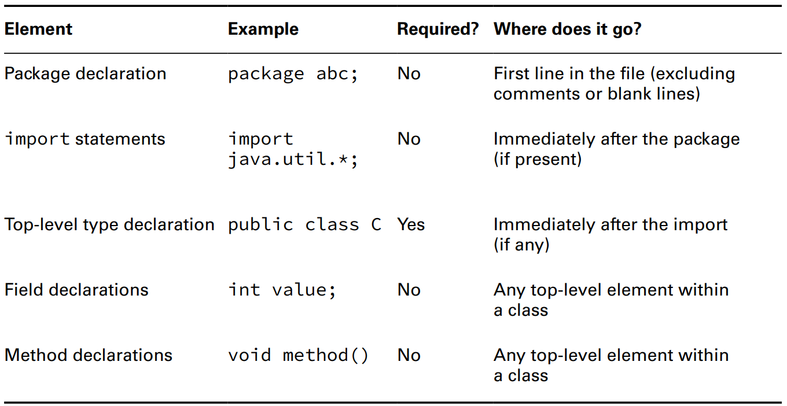
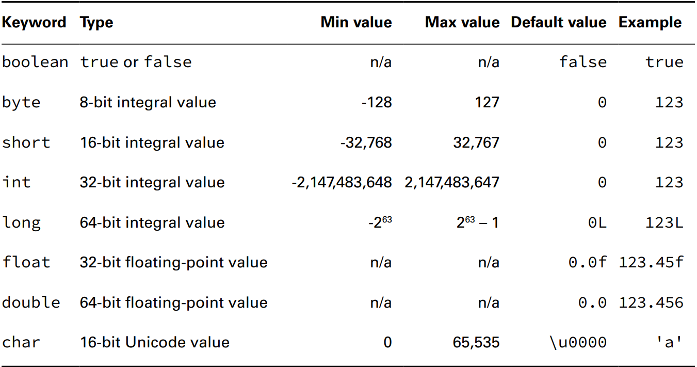
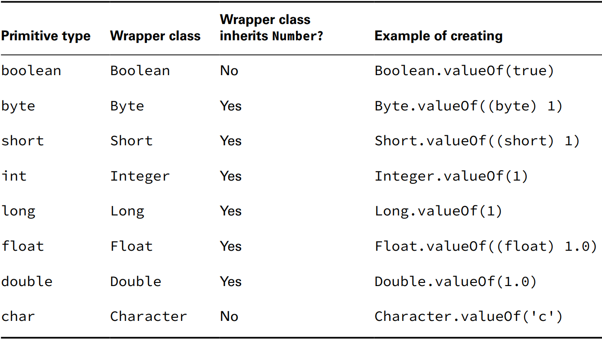

# Building Blocks  

## Understanding the Class Structure

* To use ~~all~~ most classes, you have to create objects.
* An object is a runtime instance of a class in memory.
* Each file can contain only one `public` class.
* The filename must match the class name, including case, and have a `.java` extension
* Order for declaring a class should always be in the ***`PIC`*** order
  * `P` package must be first non-comment
  * `I` import must come after package
  * `C` then comes the class
  * fields and methods can go in either order.
  * You can’t refer to a variable before it has been defined
  * We can put comments anywhere, blank lines are ignored



### Fields and Methods

*   The method name ~~and return type~~ and parameter types are called the method signature.
* ```java
  // Actual Method
  public int numberVisitors(int month) {return 10;}
  // Method signature
  numberVisitors(int);
  ```
* `public static final void main(final String... args)`
  * `public` means full access from anywhere in the
    program 
  * `static` binds a method to its class, so it can be called by just the class name
    * Java doesn’t need to create an object to call the main()
  * The keyword `void` represents the return type. A method that returns no data returns control to the caller silently 
    * it’s good practice to use void for methods that change an object’s state
  * `main()` is the starting point that the JVM looks for when it begins running a new program.
  * `final` can be omitted

## Understanding Package Declarations and Imports

*  Java classes are grouped into packages. The `import`
   statement tells the compiler which package to look in to find a `class`
* `java.lang` is automatically imported.
* The `import` statement doesn’t bring in **child packages**, **fields**, or **methods**; it imports **only** classes directly under the package.
* `import java.util.*;` import all the classes ~~and subpackages~~ in a package.
* you can only have one wildcard, and it must be at the end
* Including so many `classes` doesn't slows down your program execution.The compiler figures out what’s actually needed.
* When the class name is found in multiple packages, Java gives you a compiler error by telling you the imports are ambiguous.
* Explicitly import a class name, it takes precedence over any
  wildcards present. 
* 
## Compiling and Running Code with Packages


```java
//ClassA.java
package packageA;
public ClassA{ }
```
```java
//ClassB.java
package packageB;
public ClassB{ }
```
* By default, the javac command places the compiled classes in the same directory as the source code.
* To compile `javac packageA/ClassA.java packageB/ClassB.java` and If the command does work, two new files will be 
  created: `packageA/ClassA.class` and `packageA/ClassB.class` and to run it `java packageb.ClassB`.


* You cannot use a wildcard to include subdirectories `javac packagea/*.java packageb/*.java`
* You can also add the `.class` files into a different directory using `javac -d classes packagea/ClassA.java packageb/ClassB.java`


### Creating and Compiling JAR Files

* A Java archive (JAR) file is like a ZIP file of mainly Java **class** files and config.Prop files.
* to create a jar `jar -cvfe [JARName.Jar] [package.class with main()] [package/classes to be added.class]`
  * `-c` creates a new JAR file
  * `-v` prints details when working with JAR files
  * `-f` JAR filename
  * `-e` sets the main class *entry point* for the JAR file
* to run `java -jar [JARName.jar]`

## Objects
* `Park p = new Park();`
  * `Park` declare the type
  * `p` place to store a reference to the object
  * `new Park()` to actually create the object
* the name of the constructor matches the name of the class, and there’s ***no return*** type
```java
public class Bird {//class definition
    public static void main(String[] args) {// method declaration
        { System.out.println("Feathers"); }//inner block
    }
    { System.out.println("Snowy"); }// instance initializer
}
```
* instance initializers cannot exist inside a method. It's called inner block
* Order of Initialization
  1. Fields and instance initializer blocks are run in the order in which they appear in the file.
  2. The constructor runs after all fields and instance initializer blocks have run.

## Understanding Data Types

* Identifiers must
  * begin with a letter, a currency symbol, or a _ symbol
  * not start with numbers
  * not be only a single `_`
  * not be same name as a Java reserved word
* declare multiple variables in the same statement is legal only when they share a type.
* A `local variable` is a variable defined within a constructor, method, or initializer block
* `Local variables` do not have a default value and must be initialized before use or the file won't compile
* `var` can be only used with local variables
  * this is not allowed `var n = null;` and a value must be initialized
* instance variables or as class variables do not require you to initialize them
  * `object = null`
  * `numeric = 0, 0.0`
  * `boolean = false`
  * `char = '\u0000'`

### Primitive Types

* primitive types hold their values in the memory where the variable is allocated.
* Java interprets a decimal value as a double if it doesn't have an `F`
* Java interprets a number without a decimal point as an int if it doesn't have an `L`
* short *(signed)* and char *(unsigned)* values can be cast to one another because the underlying data size  is the same
* `double annoyingButLegal = 1____00_0.0____0;` add underscores anywhere except
  * **beginning / end** of a literal
  * right **before / after** a decimal point



### Reference Types
* A reference ***points*** to an object by storing the memory address where the object is located. A reference can be assigned to
  * another object of the same or compatible type.
  * a new object using the `new` keyword.
* The reference is a variable that has a name and can be used to access the contents of an object
* A reference can be assigned to another reference, passed to a method, or returned
  from a method.
* All references are the same size, no matter what their type is
* An object sits on the heap and does not have a name. Therefore, you have no way to access an object except through a reference
* An object cannot be assigned to another object, and an object cannot be passed to a method or returned from a method
* **It is the object that gets garbage collected, not its reference**
* Primitive types will give you a compiler error if you attempt to assign them null
* ```java
  int primitive = Integer.parseInt("123");
  Integer wrapper = Integer.valueOf("123");
  ```


