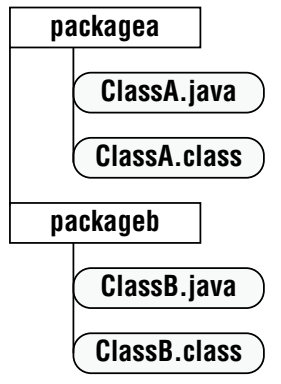
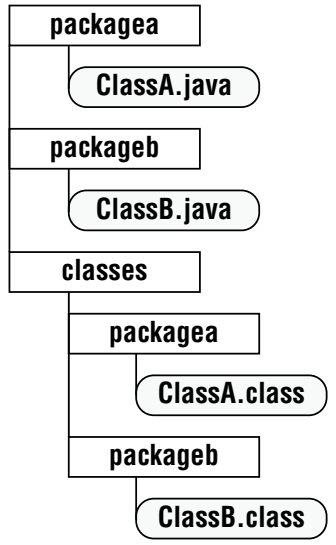

# Building Blocks

## Understanding the Class Structure

* To use most classes, you have to create objects.
* An object is a runtime instance of a class in memory.
* Each file can contain only one `public` class.
* The filename must match the class name, including case, and have a `.java` extension.
* The order for declaring a class should always follow the ***`PIC`*** order:
    * `P`: The package must be the first non-comment element.
    * `I`: Imports must come after the package declaration.
    * `C`: Then comes the class declaration.
    * Fields and methods can go in either order.
    * You can’t refer to a variable before it has been defined.
    * Comments can be placed anywhere, and blank lines are ignored.

|          Element           |        Example        | Required? |                     Where does it go?                      |
| :------------------------: | :-------------------: | :-------: | :--------------------------------------------------------: |
|    Package declaration     |    `package abc;`     |    No     | First line in the file (excluding comments or blank lines) |
|     Import statements      | `import java.util.*;` |    No     |         Immediately after the package (if present)         |
| Top-level type declaration |   `public class C`    |    Yes    |           Immediately after the imports (if any)           |
|     Field declarations     |     `int value;`      |    No     |            Any top-level element within a class            |
|    Method declarations     |    `void method()`    |    No     |            Any top-level element within a class            |

### Fields and Methods

* The method name and parameter types together are referred to as the method signature.
* ```java
  // Actual Method
  public int numberVisitors(int month) {
      return 10;
  }
  // Method signature
  numberVisitors(int); 
  ```
* The method declaration `public static final void main(final String... args)` has the following components:
    * `public` means full access from anywhere in the program.
    * `static` binds the method to its class, allowing it to be called by just the class name.
        * Java doesn’t need to create an object to call `main()`.
    * The keyword `void` represents the return type. A method that returns no data returns control to the caller
      silently.
        * It’s good practice to use `void` for methods that change an object’s state.
    * `main()` is the entry point that the JVM looks for when it begins running a new program.
    * The `final` keyword can be omitted.

## Understanding Package Declarations and Imports

* Java classes are grouped into packages. The `import` statement tells the compiler which package to look in to find
  a `class`.
* The `java.lang` package is automatically imported.
* The `import` statement doesn’t bring in **child packages**, **fields**, or **methods**; it imports **only** classes
  directly under the package.
* The statement `import java.util.*;` imports all the classes in a package.
* You can only have one wildcard, and it must be at the end.
* Including numerous `classes` does not slow down your program execution; the compiler figures out what’s actually
  needed.
* When the same class name is found in multiple packages, Java raises a compiler error indicating that the imports are
  ambiguous.
* Explicitly importing a class name takes precedence over any wildcards present.

## Compiling and Running Code with Packages

|        Step         |            Windows             |          Mac/Linux          |
| :-----------------: | :----------------------------: | :-------------------------: |
| Create first class  | `C:\temp\packagea\ClassA.java` | `/tmp/packagea/ClassA.java` |
| Create second class | `C:\temp\packageb\ClassB.java` | `/tmp/packageb/ClassB.java` |
|   Go to directory   |          `cd C:\temp`          |          `cd /tmp`          |

```java
//ClassA.java
package packageA;

public ClassA {
}
```

```java
//ClassB.java
package packageB;

public ClassB {
}
```

* By default, the javac command places the compiled classes in the same directory as the source code.
* To compile `javac packageA/ClassA.java packageB/ClassB.java` and If the command does work, two new files will be
  created: `packageA/ClassA.class` and `packageA/ClassB.class` and to run it `java packageb.ClassB`.



* You cannot use a wildcard to include subdirectories `javac packagea/*.java packageb/*.java`
* You can also add the `.class` files into a different directory
  using `javac -d classes packagea/ClassA.java packageb/ClassB.java`



### Creating and Compiling JAR Files

* A Java archive (JAR) file is like a ZIP file of mainly Java **class** files and config.Prop files.
* to create a jar `jar -cvfe [JARName.Jar] [package.class with main()] [package/classes to be added.class]`
    * `-c` creates a new JAR file
    * `-v` prints details when working with JAR files
    * `-f` JAR filename
    * `-e` sets the main class *entry point* for the JAR file
* to run `java -jar [JARName.jar]`

## Objects

* `Park p = new Park();`
    * `Park` declare the type
    * `p` place to store a reference to the object
    * `new Park()` to actually create the object
* the name of the constructor matches the name of the class, and there’s ***no return*** type

```java
public class Bird {//class definition

    public static void main(String[] args) {// method declaration
        {
            System.out.println("Feathers");
        }//inner block
    }

    {
        System.out.println("Snowy");
    }// instance initializer
}
```

* Instance initializers cannot exist inside a method; they are called inner blocks.
* **Order of Initialization**:
    1. Fields and instance initializer blocks are run in the order in which they appear in the file.
    2. The constructor runs after all fields and instance initializer blocks have executed.

## Understanding Data Types

* Identifiers must:
  * Begin with a letter, a currency symbol, or an underscore (_).
  * Not start with numbers.
  * Not be only a single underscore (_).
  * Not have the same name as a Java reserved word.
* Declaring multiple variables in the same statement is legal only when they share a type.
* A **local variable** is defined within a constructor, method, or initializer block.
* **Local variables** do not have a default value and must be initialized before use; otherwise, the file won't compile.
* `var` can only be used with local variables:
  * For example, `var n = null;` is not allowed, and a value must be initialized.
* Instance variables or class variables do not require explicit initialization:
  * `object = null`
  * `numeric = 0, 0.0`
  * `boolean = false`
  * `char = '\u0000'`
* **`final` variables don't have default values.**

### Primitive Types

* Primitive types hold their values in the memory where the variable is allocated.
* Java interprets a decimal value as a double if it doesn't have an `F`.
* Java interprets a number without a decimal point as an int if it doesn't have an `L`.
* **Short** (signed) and **char** (unsigned) values can be cast to one another because the underlying data size is the
  same.
* Example: `double annoyingButLegal = 1____00_0.0____0;` adds underscores anywhere except:
  * **Beginning / end** of a literal.
  * Right **before / after** a decimal point.

|  Keyword  |            Type             |    Min Value     |    Max Value     | Default Value |  Example   |
| :-------: | :-------------------------: | :--------------: | :--------------: | :-----------: | :--------: |
| `boolean` |        true or false        |      `n/a`       |      `n/a`       |    `false`    |   `true`   |
|  `byte`   |    8-bit integral value     |      `-128`      |      `127`       |      `0`      |   `123`    |
|  `short`  |    16-bit integral value    |    `-32,768`     |     `32,767`     |      `0`      |   `123`    |
|   `int`   |    32-bit integral value    | `-2,147,483,648` | `2,147,483,647`  |      `0`      |   `123`    |
|  `long`   |    64-bit integral value    | -2<sup>63</sup>  | 2<sup>63</sup>-1 |     `0L`      |   `123L`   |
|  `float`  | 32-bit floating-point value |      `n/a`       |      `n/a`       |    `0.0f`     | `123.456f` |
| `double`  | 64-bit floating-point value |      `n/a`       |      `n/a`       |     `0.0`     | `123.456`  |
|  `char`   |    16-bit Unicode value     |       `0`        |     `65,535`     |   `\u0000`    |    `a`     |

### Reference Types

* A reference ***points*** to an object by storing the memory address where the object is located. A reference can be
  assigned to:
  * Another object of the same or compatible type.
  * A new object using the `new` keyword.
* A reference is a variable that has a name and can be used to access the contents of an object.
* A reference can be assigned to another reference, passed to a method, or returned from a method.
* All references are the same size, regardless of their type.
* An object resides in the heap and does not have a name. Therefore, you can only access an object through a reference.
* An object cannot be directly assigned to another object, nor can it be passed to a method or returned from a method.
* **It is the object that gets garbage collected, not its reference.**
* Primitive types will generate a compiler error if you attempt to assign them `null`.

* ```java
  int primitive = Integer.parseInt("123");
  Integer wrapper = Integer.valueOf("123");
  ```

| Primitive type | Wrapper class | Wrapper class inherits Number? |     Example of creating      |
| :------------: | :-----------: | :----------------------------: | :--------------------------: |
|   `boolean`    |   `Boolean`   |              `No`              |   `Boolean.valueOf(true)`    |
|     `byte`     |    `Byte`     |             `Yes`              |   `Byte.valueOf((byte) 1)`   |
|    `short`     |    `Short`    |             `Yes`              |  `Short.valueOf((short) 1)`  |
|     `int`      |   `Integer`   |             `Yes`              |     `Integer.valueOf(1)`     |
|     `long`     |    `Long`     |             `Yes`              |      `Long.valueOf(1)`       |
|    `float`     |    `Float`    |             `Yes`              | `Float.valueOf((float) 1.0)` |
|    `double`    |   `Double`    |             `Yes`              |    `Double.valueOf(1.0)`     |
|     `char`     |  `Character`  |              `No`              |   `Character.valueOf('c')`   |
