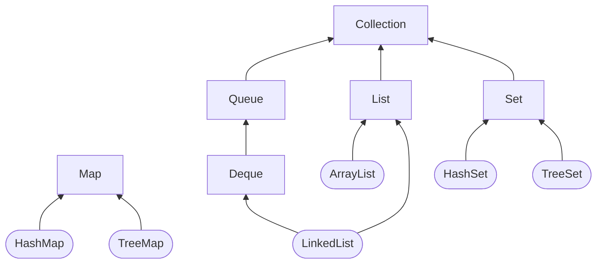

# Collections and Generics

## Using Common Collection APIs

* A collection is a group of objects contained in a single object.
* The Java Collections Framework is a set of classes in `java.util` for storing collections. There are four main interfaces in the Java Collections Framework:
  * `List`: A list is an ordered collection of elements that allows duplicate entries. Elements in a list can be accessed by an `int` index.
  * `Set`: A set is a collection that does not allow duplicate entries.
  * `Queue`: A queue is a collection that orders its elements in a specific order for processing. A `Deque` is a subinterface of `Queue` that allows access at both ends.
  * `Map`: A map is a collection that maps keys to values, with no duplicate keys allowed. The elements in a map are key/value pairs.



* In this section, we discuss the common methods that the Collections API provides to the implementing classes. Many of these methods are convenience methods that could be implemented in other ways but make your code easier to write and read. This is why they are convenient.
  
* In this section, we use ArrayList and HashSet as our implementation classes, but they can apply to any class that inherits the Collection interface. We cover the specific properties of each Collection class in the next section.

```java
//Adding Data to the end
public boolean add(E element);//Method Signature 
Collection<String> list = new ArrayList<>();
System.out.println(list.add("Sparrow")); // true
System.out.println(list.add("Sparrow")); // true

Collection<String> set = new HashSet<>();
System.out.println(set.add("Sparrow")); // true
System.out.println(set.add("Sparrow")); // false

//Removing Data
public boolean remove(Object object);//Method Signature 
Collection<String> birds = new ArrayList<>();
birds.add("hawk"); // [hawk]
birds.add("hawk"); // [hawk, hawk]
System.out.println(birds.remove("cardinal")); // false
System.out.println(birds.remove("hawk")); // true
System.out.println(birds); // [hawk]

// Counting Elements
public boolean isEmpty();//Method Signature
public int size();//Method Signature
Collection<String> birds = new ArrayList<>();
System.out.println(birds.isEmpty()); // true
System.out.println(birds.size()); // 0
birds.add("hawk"); // [hawk]
birds.add("hawk"); // [hawk, hawk]
System.out.println(birds.isEmpty()); // false
System.out.println(birds.size()); // 2

//Clearing the Collection
public void clear();//Method Signature
Collection<String> birds = new ArrayList<>();
birds.add("hawk"); // [hawk]
birds.add("hawk"); // [hawk, hawk]
System.out.println(birds.isEmpty()); // false
System.out.println(birds.size()); // 2
birds.clear(); // []
System.out.println(birds.isEmpty()); // true
System.out.println(birds.size()); // 0

//Check Contents
//Calls equals()
public boolean contains(Object object);//Method Signature
Collection<String> birds = new ArrayList<>();
birds.add("hawk"); // [hawk]
System.out.println(birds.contains("hawk")); // true
System.out.println(birds.contains("robin")); // false

//Removing with Conditions
public boolean removeIf(Predicate<? super E> filter);//Method Signature
Collection<String> list = new ArrayList<>();
list.add("Magician");
list.add("Assistant");
System.out.println(list); // [Magician, Assistant]
list.removeIf(s -> s.startsWith("A"));
System.out.println(list); // [Magician]

Collection<String> set = new HashSet<>();
set.add("Wand");
set.add("");
set.removeIf(String::isEmpty); // s -> s.isEmpty()
System.out.println(set); // [Wand]

//Iterating
public void forEach(Consumer<? super T> action);//Method Signature
Collection<String> cats = List.of("Annie", "Ripley");
cats.forEach(System.out::println);
cats.forEach(c -> System.out.println(c));

//Determining Equality
//To compare two Collections to compare the type and contents.
// ArrayList checks order,while HashSet does not.
boolean equals(Object object);//Method Signature
var list1 = List.of(1, 2);
var list2 = List.of(2, 1);
var set1 = Set.of(1, 2);
var set2 = Set.of(2, 1);
System.out.println(list1.equals(list2)); // false because of order
System.out.println(set1.equals(set2)); // true as HashSet doesn't check order
System.out.println(list1.equals(set1)); // false because types are different
```

## Using the List Interface

### Comparing List Implementations

* You use a list when you want an ordered collection that can contain duplicate entries.
* Items can be retrieved and inserted at specific positions in the list based on an int index, much like an array.
* When you aren’t sure which collection to use, use an `ArrayList`.
* The main benefit of an ArrayList is that you can look up any element in constant time.Adding or removing an element is slower than accessing an element.
* good choice when you are reading more often than (or the same amount as) writing to the `ArrayList`.
* A `LinkedList` is special because it implements both `List` and `Deque`. It has all the methods of a List. It also has additional methods to facilitate adding or removing from the beginning and/or end of the list.
* The main benefits of a `LinkedList` are that you can access, add to, and remove from the beginning and end of the list in constant time.
* The trade-off is that dealing with an arbitrary index takes linear time. This makes a `LinkedList` a good choice when you’ll be using it as `Deque`.

### Creating a List with a Factory

|          Method           |                           Description                            | Can add elements? | Can replace elements? | Can delete elements? |
| :-----------------------: | :--------------------------------------------------------------: | :---------------: | :-------------------: | :------------------: |
| `Arrays.asList(varargs)`  |            Returns fixed size list backed by an array            |        No         |          Yes          |          No          |
|    `List.of(varargs)`     |                      Returns immutable list                      |        No         |          No           |          No          |
| `List.copyOf(collection)` | Returns immutable list with copy of original collection’s values |        No         |          No           |          No          |

```java
String[] array = new String[] {"a", "b", "c"};
List<String> asList = Arrays.asList(array); // [a, b, c]
array[0] = "z";
System.out.println(asList); // [z, b, c]
asList.set(0, "x");
System.out.println(Arrays.toString(array)); // [x, b, c]
System.out.println(asList); // [x, b, c]

List<String> copy = List.copyOf(asList); // [a, b, c]
System.out.println(copy); // [a, b, c]
copy.add("y"); // UnsupportedOperationException

List<String> of = List.of(array); // [a, b, c]
System.out.println(of); // [a, b, c]
```

### Creating a List with a Constructor

* Most Collections have two constructors

```java
var linked1 = new LinkedList<String>();
var linked2 = new LinkedList<String>(linked1);

var list1 = new ArrayList<String>();
var list2 = new ArrayList<String>(list1);
var list3 = new ArrayList<String>(10);
```

### Working with List Methods

|                        Method                         |                                              Description                                              |
| :---------------------------------------------------: | :---------------------------------------------------------------------------------------------------: |
|            `public boolean add(E element)`            |                        Adds element to end (available on all Collection APIs)                         |
|        `public void add(int index,E element)`         |                        Adds element at index and moves the rest toward the end                        |
|               `public E get(int index)`               |                                       Returns element at index                                        |
|             `public E remove(int index)`              |                     Removes element at index and moves the rest toward the front                      |
| `public default void replaceAll(UnaryOperator<E> op)` |                         Replaces each element in list with result of operator                         |
|            `public E set(int index, E e)`             | Replaces element at index and returns original Throws `IndexOutOfBoundsException` if index is invalid |
|  `public default void sort(Comparator<? super E> c)`  |                                              Sorts list                                               |

```java
List<String> list = new ArrayList<>();
list.add("SD"); // [SD]
list.add(0, "NY"); // [NY,SD]
list.set(1, "FL"); // [NY,FL]
System.out.println(list.get(0)); // NY
list.remove("NY"); // [FL]
list.remove(0); // []
list.set(0, "?"); // IndexOutOfBoundsException

var numbers = Arrays.asList(1, 2, 3);
numbers.replaceAll(x -> x*2);
System.out.println(numbers); // [2, 4, 6]
```

```java
var list = new LinkedList<Integer>();//[]
list.add(3);//[3]
list.add(2);//[3, 2]
list.add(1);//[3, 2, 1]
list.remove(2);//[3, 2]
list.remove(Integer.valueOf(2));//[3]
System.out.println(list);//[3]
```

### Converting from List to an Array

```java
List<String> list = new ArrayList<>();//[]
list.add("hawk");//[hawk]
list.add("robin");//[hawk, robin]
Object[] objectArray = list.toArray();//[hawk, robin] defaults to an array of class Object
//The array is a newly created object with no relationship to the original List. It is simply a copy.
String[] stringArray = list.toArray(new String[0]);//[]
list.clear();//[]
System.out.println(objectArray.length); // 2
System.out.println(stringArray.length); // 2
```

## Using the Set Interface

### Comparing Set Implementations

* A `HashSet` stores its elements in a hash table, which means the keys are a hash and the values are an `Object`. This means that the `HashSet` uses the `hashCode()` method of the objects to retrieve them more efficiently. Remember that a valid `hashCode()` doesn’t mean every object will get a unique value, but the method is often written so that hash values are spread out over a large range to reduce collisions.
* The main benefit is that adding elements and checking whether an element is in the set both have constant time. The trade-off is that you lose the order in which you inserted the elements. Most of the time, you aren’t concerned with this in a Set anyway, making `HashSet` the most common set.
* A TreeSet stores its elements in a sorted tree structure. The main benefit is that the set is always in sorted order. The trade-off is that adding and checking whether an element exists takes longer than with a HashSet, especially as the tree grows larger.

### Working with Set Methods

* Remember that the `equals()` method is used to determine equality. The `hashCode()` method is used to know which bucket to look in so that Java doesn’t have to look through the whole set to find out whether an object is there. The best case is that hash codes are unique and Java has to call `equals()` on only one object.
* The worst case is that all implementations return the same `hashCode()` and Java has to call `equals()` on every element of the set anyway.

```java
Set<Character> letters = Set.of('z', 'o', 'o');
Set<Character> copy = Set.copyOf(letters);

Set<Integer> set = new HashSet<>();
boolean b1 = set.add(66); // true
boolean b2 = set.add(10); // true
boolean b3 = set.add(66); // false
boolean b4 = set.add(8); // true
set.forEach(System.out::println);//[66, 8, 10]

//The elements are printed out in their natural sorted order.
//Numbers implement the Comparable interface in Java, which is used for sorting.
Set<Integer> treeSet = new TreeSet<>();
boolean b1 = treeSet.add(66); // true
boolean b2 = treeSet.add(10); // true
boolean b3 = treeSet.add(66); // false
boolean b4 = treeSet.add(8); // true
treeSet.forEach(System.out::println);//[8, 10, 66]
```

## Using the Queue and Deque Interfaces

* You use a `Queue` _(FIFO)_ when elements are added and removed in a specific order.
* A `Deque` _(double-ended queue)_ is different from a regular queue in that you can insert and remove elements from both the front (head) and back (tail).

### Comparing Deque Implementations

* The main benefit of a `LinkedList` is that it implements both the `List` and `Deque` interfaces.
* The trade-off is that it isn’t as efficient as a “pure” queue. You can use the `ArrayDeque` class if you don’t need the `List` methods.

### Working with Queue and Deque Methods

|       Functionality       |             Methods              |
| :-----------------------: | :------------------------------: |
|       Add to front        |   `public void addFirst(E e)`    |
|       Add to front        | `public boolean offerFirst(E e)` |
|        Add to back        |    `public void addLast(E e)`    |
|        Add to back        | `public boolean offerLast(E e)`  |
|        Add to back        |    `public boolean add(E e)`     |
|        Add to back        |   `public boolean offer(E e)`    |
|      Read from front      |      `public E getFirst()`       |
|      Read from front      |      `public E peekFirst()`      |
|      Read from front      |       `public E element()`       |
|      Read from front      |        `public E peek()`         |
|      Read from back       |       `public E getLast()`       |
|      Read from back       |      `public E peekLast()`       |
| Get and remove from front |     `public E removeFirst()`     |
| Get and remove from front |      `public E pollFirst()`      |
| Get and remove from front |       `public E remove()`        |
| Get and remove from front |        `public E poll()`         |
| Get and remove from back  |     `public E removeLast()`      |
| Get and remove from back  |      `public E pollLast()`       |

```java
Queue<Integer> queue = new LinkedList<>();
queue.add(10);
queue.add(4);
System.out.println(queue.remove()); // 10
System.out.println(queue.peek()); // 4

Deque<Integer> deque = new LinkedList<>();
deque.offerFirst(10); // true
deque.offerLast(4); // true
deque.peekFirst(); // 10
deque.pollFirst(); // 10
deque.pollLast(); // 4
deque.pollFirst(); // null
deque.peekFirst(); // null
```

### Using a Deque as a stack

|        Functionality        |      Methods      |
| :-------------------------: | :---------------: |
| Add to the front/top public | `void push(E e)`  |
|  Remove from the front/top  | `public E pop()`  |
|      Get first element      | `public E peek()` |

```java
Deque<Integer> stack = new ArrayDeque<>();
stack.push(10);//10
stack.push(4);//4, 10
stack.peek(); // 4
stack.poll(); // 4 
stack.poll(); // 10
stack.peek(); // null
```

## Using the Map Interface

```java
//Just like List and Set, there is a factory method to create a Map
Map.of("key1", "value1", "key2", "value2");
Map.ofEntries(
Map.entry("key1", "value1"),
Map.entry("key2", "value2")
);
```

### Comparing Map Implementations

* A `HashMap` stores the keys in a hash table. This means that it uses the `hashCode()` method of the keys to retrieve their values more efficiently.
* The main benefit is that adding elements and retrieving the element by key both have constant time.
* The trade-off is that you lose the order in which you inserted the elements. If you're concerned by the order of insertion you could use `LinkedHashMap`.
* A `TreeMap` stores the keys in a sorted tree structure. The main benefit is that the keys are always in sorted order. Like a `TreeSet`, the trade-off is that adding and checking whether a key is present takes longer as the tree grows larger.

### Working with Map Methods

* Given that `Map` doesn’t extend `Collection`, more methods are specified on the `Map` interface.

|                          Method                           |                                                Description                                                |
| :-------------------------------------------------------: | :-------------------------------------------------------------------------------------------------------: |
|                   `public void clear()`                   |                                   Removes all keys and values from map                                    |
|         `public boolean containsKey(Object key)`          |                                       Returns whether key is in map                                       |
|       `public boolean containsValue(Object value)`        |                                      Returns whether value is in map                                      |
|          `public Set<Map.Entry<K,V>> entrySet()`          |                                     Returns `Set` of key/value pairs                                      |
|     `public void forEach(BiConsumer<K key, V value>)`     |                                     Loops through each key/value pair                                     |
|                `public V get(Object key)`                 |                          Returns value mapped by key or `null` if none is mapped                          |
|    `public V getOrDefault(Object key,V defaultValue)`     |                      Returns value mapped by key or default value if none is mapped                       |
|                `public boolean isEmpty()`                 |                                       Returns whether map is empty                                        |
|                 `public Set<K> keySet()`                  |                                          Returns set of all keys                                          |
| `public V merge(K key, V value,Function(<V, V, V> func))` | `Sets` value if key not set. Runs function if key is set, to determine new value Removes if value is null |
|              `public V put(K key, V value)`               |                      Adds or replaces key/value pair. Returns previous value or null                      |
|          `public V putIfAbsent(K key, V value)`           |             Adds value if key not present and returns null. Otherwise, returns existing value             |
|               `public V remove(Object key)`               |                       Removes and returns value mapped to key. Returns null if none                       |
|            `public V replace(K key, V value)`             |            Replaces value for given key if key is set. Returns original value or null if none             |
|    `public void replaceAll(BiFunction<K, V, V> func)`     |                               Replaces each value with results of function                                |
|                    `public int size()`                    |                             Returns number of entries (key/valuepairs) in map                             |
|              `public Collection<V> values()`              |                                     Returns Collection of all values                                      |

### Calling Basic Methods

```java
//Not Sorted
Map<String, String> map = new HashMap<>();
map.put("koala", "bamboo");
map.put("lion", "meat");
map.put("giraffe", "leaf");
String food = map.get("koala"); // get bamboo value using key koala
for (String key: map.keySet())//get all keys
System.out.print(key + ","); // koala,giraffe,lion,
System.out.println(map.contains("lion")); // DOES NOT COMPILE because it's related to Collections not Map interface
System.out.println(map.containsKey("lion")); // true
System.out.println(map.containsValue("lion")); // false
System.out.println(map.size()); // 3
map.clear();
System.out.println(map.size()); // 0
System.out.println(map.isEmpty()); // true

//Sorted 
Map<String, String> treeMap = new TreeMap<>();
treeMap.put("koala", "bamboo");
treeMap.put("lion", "meat");
treeMap.put("giraffe", "leaf");
String food = treeMap.get("koala"); // bamboo
//values() instead of keySet() then the order of the values would correspond to the order of the keys.
for (String key: treeMap.keySet())
System.out.print(key + ","); // giraffe,koala,lion,
```

### Iterating through a Map

```java
Map<Integer, Character> map = new HashMap<>();
map.put(1, 'a');
map.put(2, 'b');
map.put(3, 'c');
map.forEach((k, v) -> System.out.println(v));
map.values().forEach(System.out::println);
map.entrySet().forEach(e - >System.out.println(e.getKey() + " " + e.getValue()));
```

### Getting Values Safely

* The `get()` method returns null if the requested key is not in the map. Sometimes you prefer to have a different value returned. Luckily, the `getOrDefault()` method makes this easy.

```java
Map<Character, String> map = new HashMap<>();
map.put('x', "spot");
System.out.println("X marks the " + map.get('x'));//X marks the spot
System.out.println("X marks the " + map.getOrDefault('x', ""));//X marks the spot
System.out.println("Y marks the " + map.get('y'));//Y marks the null
System.out.println("Y marks the " + map.getOrDefault('y', ""));//Y marks the
```

### Replacing Values

```java
Map<Integer, Integer> map = new HashMap<>();
map.put(1, 2);
map.put(2, 4);
Integer original = map.replace(2, 10); // 4
System.out.println(map); // {1=2, 2=10}
map.replaceAll((k, v) -> k + v);
System.out.println(map); // {1=3, 2=12}
```

### Putting if Absent

* The `putIfAbsent()` method sets a value in the map but skips it if the value is already set to a non-null value.

```java
Map<String, String> favorites = new HashMap<>();
favorites.put("Jenny", "Bus Tour");
favorites.put("Tom", null);
favorites.putIfAbsent("Jenny", "Tram");
favorites.putIfAbsent("Sam", "Tram");
favorites.putIfAbsent("Tom", "Tram");
System.out.println(favorites); // {Tom=Tram, Jenny=Bus Tour, Sam=Tram}
```

### Merging Data

* The `merge()` method adds logic of what to choose. Suppose we want to choose the ride with the longest name.

```java
BiFunction<String, String, String> mapper = (v1, v2)
- > v1.length()> v2.length() ? v1: v2;
Map<String, String> favorites = new HashMap<>();
favorites.put("Jenny", "Bus Tour");
favorites.put("Tom", "Tram");

String jenny = favorites.merge("Jenny", "Skyride", mapper);
String tom = favorites.merge("Tom", "Skyride", mapper);

System.out.println(favorites); // {Tom=Skyride, Jenny=Bus Tour}
System.out.println(jenny); // Bus Tour
System.out.println(tom); // Skyride
```

* The final thing to know about `merge()` is what happens when the mapping function is called and returns `null`. The key is removed from the map when this happens:

```java
BiFunction<String, String, String> mapper = (v1, v2) -> null;
Map<String, String> favorites = new HashMap<>();
favorites.put("Jenny", "Bus Tour");
favorites.put("Tom", "Bus Tour");
favorites.merge("Jenny", "Skyride", mapper);
favorites.merge("Sam", "Skyride", mapper);
System.out.println(favorites); // {Tom=Bus Tour, Sam=Skyride}
```

|     If the requested key      |   And mapping function returns    |                                     Then:                                     |
| :---------------------------: | :-------------------------------: | :---------------------------------------------------------------------------: |
|   Has a `null` value in map   | N/A (mapping function not called) |                Update key’s value in map with value parameter                 |
| Has a non-`null` value in map |              `null`               |                              Remove key from map                              |
| Has a non-`null` value in map |        A non-`null` value         |                      Set key to mapping function result                       |
|         Is not in map         | N/A (mapping function not called) | Add key with value parameter to map directly without calling mapping function |

### Comparing Collection Types

|  Type   | Can contain duplicate elements? |    Elements always ordered?     | Has keys and values? | Must add/remove in specific order? |
| :-----: | :-----------------------------: | :-----------------------------: | :------------------: | :--------------------------------: |
| `List`  |               Yes               |          Yes(by index)          |          No          |                 No                 |
|  `Map`  |         Yes(for values)         |               No                |         Yes          |                 No                 |
| `Queue` |               Yes               | Yes(retrieved in defined order) |          No          |                Yes                 |
|  `Set`  |               No                |               No                |          No          |                 No                 |

|     Type     | Java Collections Framework interface | Sorted? | Calls `hashCode`? | Calls `compareTo`? |
| :----------: | :----------------------------------: | :-----: | :---------------: | :----------------: |
| `ArrayDeque` |               `Deque`                |   No    |        No         |         No         |
| `ArrayList`  |                `List`                |   No    |        No         |         No         |
|  `HashMap`   |                `Map`                 |   No    |        Yes        |         No         |
|  `HashSet`   |                `Set`                 |   No    |        Yes        |         No         |
| `LinkedList` |           `List`, `Deque`            |   No    |        No         |         No         |
|  `TreeMap`   |                `Map`                 |   Yes   |        No         |        Yes         |
|  `TreeSet`   |                `Set`                 |   Yes   |        No         |        Yes         |

## Sorting Data

* The data structures that involve sorting do not allow null values.
* For numbers, order is obvious it is numerical order. For String objects, order is defined according to the Unicode character mapping.
* `Collections.sort()` returns void because the method parameter is what gets sorted.
* If your class implements `Comparable`, it can be used in data structures that require comparison.
* `Comparator` is used to specify that you want to use a different order than the object itself provides.

### Creating a Comparable Class

* There are three rules to know:
  * The number 0 is returned when the current object is equivalent to the argument to `compareTo()`.
  * A negative number (less than 0) is returned when the current object is smaller than the argument to `compareTo()`.
  * A positive number (greater than 0) is returned when the current object is larger than the argument to `compareTo()`.
* Keeping compareTo() and equals() Consistent
  
```java
public interface Comparable<T> {
int compareTo(T o);
}
import java.util.*;
public class Duck implements Comparable<Duck> {
private String name;
public Duck(String name) {
this.name = name;
}
public String toString() { // use readable output
return name;
}
public int compareTo(Duck d) {
if (d == null)
throw new IllegalArgumentException("Poorly formed duck!");
if (this.name == null && d.name == null)
return 0;
else if (this.name == null) return -1;
else if (d.name == null) return 1;
else return name.compareTo(d.name);// sorts ascendingly by name
}

public static void main(String[] args) {
var ducks = new ArrayList<Duck>();
ducks.add(new Duck("Quack"));
ducks.add(new Duck("Puddles"));
Collections.sort(ducks); // sort by name
System.out.println(ducks); // [Puddles, Quack]
}}
```

### Comparing Data with a Comparator

* to sort an object that did not implement Comparable, or you want to sort objects in different ways at different times.
* Comparable and Comparator are in different packages: java.lang and java.util, respectively

```java
import java.util.ArrayList;
import java.util.Collections;
import java.util.Comparator;

public class Duck implements Comparable<Duck> {
private String name;
private int weight;

// Assume getters/setters/constructors provided
public String toString() { return name; }
public int compareTo(Duck d) {
return name.compareTo(d.name);
}

public static void main(String[] args) {
Comparator<Duck> byWeight = new Comparator<Duck>() {
public int compare(Duck d1, Duck d2) {
return d1.getWeight()-d2.getWeight();
}
};
//Or
Comparator<Duck> byWeight = (d1, d2) -> d1.getWeight()-d2.getWeight();
//Or
Comparator<Duck> byWeight = Comparator.comparing(Duck::getWeight);
var ducks = new ArrayList<Duck>();
ducks.add(new Duck("Quack", 7));
ducks.add(new Duck("Puddles", 10));
Collections.sort(ducks);
System.out.println(ducks); // [Puddles, Quack]
Collections.sort(ducks, byWeight);
System.out.println(ducks); // [Quack, Puddles]
}
}
```

### Comparison of Comparable and Comparator

|                    Difference                     |  Comparable   | Comparator  |
| :-----------------------------------------------: | :-----------: | :---------: |
|                   Package name                    |  `java.lang`  | `java.util` |
| Interface must be implemented by class comparing? |      Yes      |     No      |
|             Method name in interface              | `compareTo()` | `compare()` |
|               Number of parameters                |       1       |      2      |
|         Common to declare using a lambda          |      No       |     Yes     |

### Comparing Multiple Fields

```java
public class Squirrel {
private int weight;
private String species;
// Assume getters/setters/constructors provided
}
Comparator<Squirrel> c = Comparator.comparing(Squirrel::getSpecies).thenComparingInt(Squirrel::getWeight);
var c = Comparator.comparing(Squirrel::getSpecies).reversed();
```

### Helper static methods for building a Comparator

|           Method            |                                           Description                                           |
| :-------------------------: | :---------------------------------------------------------------------------------------------: |
|    `comparing(function)`    | Compare by results of function that returns any `Object` (or primitive autoboxed into `Object`) |
| `comparingDouble(function)` |                      Compare by results of function that returns `double`                       |
|  `comparingInt(function)`   |                        Compare by results of function that returns `int`                        |
|  `comparingLong(function)`  |                       Compare by results of function that returns `long`                        |
|      `naturalOrder()`       |        `Sort` using order specified by the `Comparable` implementation on object itself         |
|      `reverseOrder()`       |     `Sort` using reverse of order specified by `Comparable` implementation on object itself     |

### Helper default methods for building a Comparator

|             Method              |                                                           Description                                                           |
| :-----------------------------: | :-----------------------------------------------------------------------------------------------------------------------------: |
|          `reversed()`           |                                              Reverse order of chained `Comparator`                                              |
|    `thenComparing(function)`    |           If previous `Comparator` returns 0, use this comparator that returns `Object` or can be autoboxed into one            |
| `thenComparingDouble(function)` | If previous `Comparator` returns 0, use this comparator that returns double. Otherwise, return value from previous `Comparator` |
|  `thenComparingInt(function)`   |  If previous `Comparator` returns 0, use this comparator that returns int. Otherwise, return value from previous `Comparator`   |
|  `thenComparingLong(function)`  |  If previous `Comparator` returns 0, use this comparator that returns long. Otherwise, return value from previous `Comparator`  |

### Sorting and Searching

* The `Collections.sort()` method uses the `compareTo()` method to sort. It expects the objects to be sorted to be `Comparable`.

```java
public class SortRabbits {
static record Rabbit(int id) {}
public static void main(String[] args) {
List<Rabbit> rabbits = new ArrayList<>();
rabbits.add(new Rabbit(3));
rabbits.add(new Rabbit(1));
Collections.sort(rabbits); // DOES NOT COMPILE because class doesn't implement Comparable
//Fix the issue
Comparator<Rabbit> c = (r1, r2) -> r1.id - r2.id;
Collections.sort(rabbits, c);
System.out.println(rabbits); // [Rabbit[id=1], Rabbit[id=3]]
//Sort the rabbits in descending order
Comparator<Rabbit> c = (r1, r2) -> r1.id - r2.id;
Collections.sort(rabbits, c);
Collections.reverse(rabbits);
System.out.println(rabbits); // [Rabbit[id=3], Rabbit[id=1]]
} }
```

```java
var names = Arrays.asList("Fluffy", "Hoppy");
Comparator<String> c = Comparator.reverseOrder();
var index = Collections.binarySearch(names, "Hoppy", c);
System.out.println(index);
```

* collections that require classes to implement Comparable. Unlike sorting, they don’t check that you have implemented Comparable at compile time.

```java
public class UseTreeSet {
    static class Rabbit{ int id; }
    public static void main(String[] args) {
    Set<Duck> ducks = new TreeSet<>();
    //Duck does implement Comparable
    ducks.add(new Duck("Puddles"));
    Set<Rabbit> rabbits = new TreeSet<>();
    rabbits.add(new Rabbit()); // ClassCastException
    } }
```

```java
Set<Rabbit> rabbits = new TreeSet<>((r1, r2) -> r1.id - r2.id);
rabbits.add(new Rabbit());
```

## Working with Generics

### Naming Conventions for Generics

|   Name    |               Description               |
| :-------: | :-------------------------------------: |
|    `E`    |             for an element              |
|    `K`    |              for a map key              |
|    `V`    |             for a map value             |
|    `N`    |              for a number               |
|    `T`    |         for a generic data type         |
| `S, U, V` | and so forth for multiple generic types |

* _**Understanding Type Erasure**_ allows the compiler to enforce proper use of the generic type. However, this is just for compile time.

```java
public class SizeLimitedCrate<T, U> {
private T contents;
private U sizeLimit;
public SizeLimitedCrate(T contents, U sizeLimit) {
this.contents = contents;
this.sizeLimit = sizeLimit;
} }

Elephant elephant = new Elephant();
Integer numPounds = 15_000;
SizeLimitedCrate<Elephant, Integer> c1 = new SizeLimitedCrate<>(elephant, numPounds);
```

* Behind the scenes, the compiler replaces all references to T in Crate with Object. In other words, after the code compiles, your generics are just Object types. The Crate class looks like the following at runtime:

```java
public class Crate {
private Object contents;
public Object lookInCrate() {
return contents;
}
public void packCrate(Object contents) {
this.contents = contents;
}
}
```

### Overloading a Generic Method

* Only one of these two methods is allowed in a class because type erasure will reduce both sets of arguments to (List input):
* For the same reason, you also can’t overload a generic method from a parent class.

```java
public class LongTailAnimal {
protected void chew(List<Object> input) {}
protected void chew(List<Double> input) {} // DOES NOT COMPILE because of type erasure.
}
```

### Returning Generic Types

* When you’re working with overridden methods that return generics, the return values must be covariant.
* In terms of generics, this means that the return type of the class or interface declared in the overriding method must be a subtype of the class defined in the parent class.
* _**The generic parameter type must match its parent’s type exactly**_.
* Generic methods cannot be overloaded by changing the generic parameter type only

```java
public class Mammal {
public List<CharSequence> play() { ... }
public CharSequence sleep() { ... }
}
//The Monkey class compiles because ArrayList is a subtype of List
public class Monkey extends Mammal {
public ArrayList<CharSequence> play() { ... }
}
public class Goat extends Mammal {
//String is a subtype of CharSequence, it does not exactly match the generic type defined in the Mammal class
// Therefore, this is considered an invalid override
public List<String> play() { ... } // DOES NOT COMPILE
public String sleep() { ... }
}
```

### Implementing Generic Interface

* There are three ways a class can approach implementing this interface:

```java
public interface Shippable<T> {
void ship(T t);
}
class ShippableAbstractCrate<U> implements Shippable<U> {
public void ship(U t) { }
}
class ShippableRobotCrate implements Shippable<Robot> {
public void ship(Robot t) { }
}
//Seen alot in legacy code and would Generate a Warning not an Error
class ShippableCrate implements Shippable {
public void ship(Object t) { }
}
```

* _**What You Can’t Do with Generic Types:**_
  * _**Call a constructor:**_ Writing `new T()` is not allowed because at runtime, it would be `new Object()`.
  * _**Create an array of that generic type:**_ This one is the most annoying, but it makes sense because you’d be creating an array of `Object` values.
  * _**Call instanceof:**_ This is not allowed because at runtime `List<Integer>` and `List<String>` look the same to Java, thanks to type erasure.
  * _**Use a primitive type as a generic type parameter:**_ If you want a type of `int`, just use `Integer`.
  * _**Create a static variable as a generic type parameter:**_ This is not allowed because the type is linked to the instance of the class yet it's allowed on `Static` methods.

### Writing Generic Methods

* This is often useful for `static` methods since they aren’t part of an instance that can declare the type.

```java
public class Handler {
public static <T> void prepare(T t) {
System.out.println("Preparing " + t);
}
public static <T> Crate<T> ship(T t) {
System.out.println("Shipping " + t);
return new Crate<T>();
}
}
```

```java
public class More {
//formal parameter type immediately before the return type of void
public static <T> void sink(T t) { }
//return type being the formal parameter type
public static <T> T identity(T t) { return t; }
//omits the formal parameter type and therefore does not compile
public static T noGood(T t) { return t; } // DOES NOT COMPILE
}
```

> _**Optional Syntax for Invoking a Generic Method**_
> You can call a generic method normally, and the compiler will try to figure out which one you want. Alternatively, you can specify the type explicitly to make it obvious what the type is `Box.<String>ship("package");` or `Box.<String[]>ship(args);` It is up to you whether this makes things clearer. You should at least be aware that this
syntax exists.

* When you have a method declare a generic parameter type, it is independent of the class generics. Take a look at this class that declares a generic `T` at both levels:

```java
//T is Robot because that is what gets referenced when constructing a Crate.
public class TrickyCrate<T> {
    //T is String because that is what is passed to the method.
    public <T> T tricky(T t) {
    return t;
    }
}
public static String crateName() {
    TrickyCrate<Robot> crate = new TrickyCrate<>();
    return crate.tricky("bot");
}
```

### Creating a Generic Record

```java
public record CrateRecord<T>(T contents) {
@Override
public T contents() {
if (contents == null)
throw new IllegalStateException("missing contents");
return contents;
}
}
Robot robot = new Robot();
CrateRecord<Robot> record = new CrateRecord<>(robot);
```

### Bounding Generic Types

|       Type of bound       |      Syntax      |                              Example                               |
| :-----------------------: | :--------------: | :----------------------------------------------------------------: |
|    Unbounded wildcard     |       `?`        |               `List<?> a = new ArrayList<String>();`               |
| Wildcard with upper bound | `? extends type` | `List<? extends Exception> a = new ArrayList<RuntimeException>();` |
| Wildcard with lower bound |  `? super type`  |       `List<? super Exception> a = new ArrayList<Object>();`       |

### Creating Unbounded Wildcards

```java
public static void printList(List<?> list) {
for (Object x: list)
System.out.println(x);
}
public static void main(String[] args) {
List<String> keywords = new ArrayList<>();
keywords.add("java");
printList(keywords);
}
```

* Do you think these two statements are equivalent? They are not. There are two key differences. First, `x1` is of type `List`, while `x2` is of type `ArrayList`. Additionally, we can only assign `x2` to a `List<Object>`. These two variables do have one thing in common. Both return type `Object` when calling the `get()` method.

```java
List<?> x1 = new ArrayList<>();
var x2 = new ArrayList<>();
```

### Creating Upper-Bounded Wildcards

* a generic type can’t just use a subclass.
* The upper-bounded wildcard says that any class that `extends Number` or `Number` itself can be used as the formal parameter type:

```java
//Issue
ArrayList<Number> list = new ArrayList<Integer>(); // DOES NOT COMPILE
//Fix
List<? extends Number> list = new ArrayList<Integer>();

public static long total(List<? extends Number> list) {
long count = 0;
for (Number number: list)
count += number.longValue();
return count;
}
```

* Something interesting happens when we work with upper bounds or unbounded wildcards. The list becomes logically immutable and therefore cannot be modified
* The problem stems from the fact that Java doesn’t know what type `List<? extends Bird>` really is. It could be `List<Bird>` or `List<Sparrow>` or some other generic type that hasn’t even been written yet

```java
static class Sparrow extends Bird { }
static class Bird { }

public static void main(String[] args) {
List<? extends Bird> birds = new ArrayList<Bird>();
birds.add(new Sparrow()); // DOES NOT COMPILE
birds.add(new Bird()); // DOES NOT COMPILE
}
```

## Creating Lower-Bounded Wildcards

```java
List<String> strings = new ArrayList<String>();
strings.add("tweet");

List<Object> objects = new ArrayList<Object>(strings);
addSound(strings);
addSound(objects);
```

| `static void addSound(______ list) {list.add("quack");}` |              Method compiles              |         Can pass a `List<String>`         | Can pass a `List<Object>` |
| :------------------------------------------------------: | :---------------------------------------: | :---------------------------------------: | :-----------------------: |
|                        `List<?>`                         |   No (unbounded generics are immutable)   |                    Yes                    |            Yes            |
|                 `List<? extends Object>`                 | No (upper-bounded generics are immutable) |                    Yes                    |            Yes            |
|                      `List<Object>`                      |                    Yes                    | No (with generics, must pass exact match) |            Yes            |
|                  `List<? super String>`                  |                    Yes                    |                    Yes                    |            Yes            |

```java
//ist will be a list of String objects or a list of some objects that are a superclass of String
public static void addSound(List<? super String> list) {
list.add("quack");
}
```

### Combining Generic Declarations

```java
class A {}
class B extends A {}
class C extends B {}
List<?> list1 = new ArrayList<A>();
List<? extends A> list2 = new ArrayList<A>();
List<? super A> list3 = new ArrayList<A>();
List<? extends B> list4 = new ArrayList<A>(); // DOES NOT COMPILE
List<? super B> list5 = new ArrayList<A>();
//The problem is that you need to know what that type will be when instantiating the ArrayList.
//you can’t add any elements to that ArrayList.
List<?> list6 = new ArrayList<? extends A>(); // DOES NOT COMPILE
```

### Passing Generic Arguments

```java
//returns single object of that T type
<T> T first(List<? extends T> list) {//takes a parameter of List<T>, or some subclass of T
return list.get(0);
}
//return type isn’t actually a type.
<T> <? extends T> second(List<? extends T> list) { // DOES NOT COMPILE
return list.get(0);
}
//B can represent class A, B, or C, because all extend the A class. Since B no longer refers to the B class in the method, you can’t instantiate it.
<B extends A> B third(List<B> list) {
return new B(); // DOES NOT COMPILE
}
// tries to mix a method-specific type parameter with a wildcard. A wildcard must have a ? in it.
<X> void fifth(List<X super B> list) { // DOES NOT COMPILE
}
```
