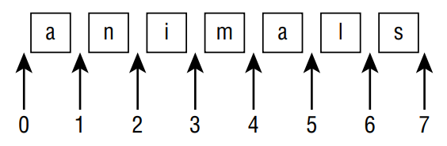

# Core APIs

## String Class

* `String` and `StringBuilder` implements `CharSequence` interface
* `String` is immutable, or unchangeable so method chaining will return a different `String` object rather than changing the value of the reference
### Most common String methods
```java
//number of characters
String name = "Mohamed".length();
//character at index
char character = name.charAt(7);//exception
//finds the first index that matches the desired value or -1
int indexOf(String str);
int lastIndexOf(String str);
int indexOf(String str, int fromIndex);
int lastIndexOf(String str, int fromIndex);

boolean startsWith(String prefix);
boolean startsWith(String prefix, int offset);
boolean endsWith(String suffix);
boolean contains(CharSequence charSeq);
boolean contentEquals(CharSequence charSeq);

boolean isEmpty();//check if length() is 0
boolean isBlank();//only contains white spaces 

String[] split(String regex);
static String join(CharSequence delimiter, CharSequence... elements);

//strip() is equal to trim() but supports unicode
String strip();
String stripLeading();
String stripTrailing();
String trim();
String indent(int numberSpaces);
String stripIndent();

String toLowerCase();
String toUpperCase();
String replace(CharSequence target, CharSequence replacement);
```
* What does normalizing whitespace mean, you ask? First, a line break is added to the end of the string if not already there. Second, any line breaks are converted to the \n format.

 and 
stripIndent()")

```java
//checks whether two String objects contain exactly the same characters in the same order
boolean equals(Object obj);
boolean equalsIgnoreCase(String str);
```

* Pretend the indexes are right before the character they would point to for the substring methods



```java
String substring(int beginIndex);
String substring(int beginIndex, int endIndex);//endIndex not included
String name = "Mohamed".substring(8,2);//exception
```
* **Overriding** `toString()`, `equals(Object)`, and `hashCode()`
  * `equals(Object obj)`: default implementation just using the `==` operator, so it need to be overridden
  * `hashCode()`: Any time you override `equals(Object)`, you must override
    `hashCode()` to be consistent. This means that for any two objects, if a.equals(b) is true, then a.hashCode()==b.
    hashCode() must also be true. **If they are not consistent, this could lead to invalid data and side effects in hash-based collections such as
    HashMap and HashSet.**
* ```java
  // IllegalFormatConversionException if wrong types were used
  System.out.println("Hello %s, order %d is ready".formatted(name, orderId));
  ```

|  Symbol  |                           Description                            |
|:--------:|:----------------------------------------------------------------:|
|    %s    |           Applies to any type, commonly String values            |
|    %d    |           Applies to integer values like int and long            |
|    %f    |      Applies to floating-point values like float and double      | 
|    %n    |  Inserts a line break using the system-dependent line separator  | 

```java
var pi = 3.14159265359;
System.out.format("[%f]",pi); // [3.141593]
System.out.format("[%12.8f]",pi); // [ 3.14159265]
System.out.format("[%012f]",pi); // [00003.141593]
System.out.format("[%12.2f]",pi); // [ 3.14]
System.out.format("[%.3f]",pi); // [3.142]
```

## StringBuilder and StringBuffer Classes
* `StringBuffer` is the same as `StringBuilder` except it supports threads, so it's slower
* the StringBuilder changes its own state and returns a reference to itself when using method chaining
* common method between `String` and `StringBuilder` are `indexOf()`,`length()`,`subString()`,`charAt()`
* `subString()` returns a String rather than a StringBuilder. So when it's called from the `StringBuilder` reference 
  nothing will be changed.
* Almost all `StringBuilder` and `StringBuffer` methods return `this` so during the **method chaining** we don't 
  create an object for each method like the `String` class it just `return` references to the current `Object`
* `equals(Object object)` in `StringBuilder` is not `Overridden` so it will have the default implementation `==`

### Most common StringBuilder and StringBuffer methods
```java
    StringBuilder alpha = new StringBuilder();
    alpha.append("A");// not alpha =  alpha.append("A");
    StringBuilder append(String str);
    StringBuilder insert(int offset, String str);
    StringBuilder delete(int startIndex, int endIndex);//endIndex can be greater than length
    StringBuilder deleteCharAt(int index);//StringIndexOutOfBoundsException
    StringBuilder reverse();
    StringBuilder replace(int startIndex, int endIndex, String newString);// Allows endIndex > length
```
### Understanding Equality and String Pool

* `==` check whether the references are referring to the same object and `equals(Object object)` check the content 
  of `Object` if it's`Overridden`
* Using a literal `String` goes into the string pool. The `myObject.toString()` method returns a string but 
  not a literal, so it does not go into the string pool as function are invoked in the `runtime`.
* any `method` on string creates a new `object` in the `intern pool` or `string pool`. Only the literal and the 
  `+` of  **string literal** is considered as compile-time, so it's added to the pool.
  (compile-time) strings are added to the pool
* String objects can be moved  from the heap to the pool using `intern()` and not vice versa

## Arrays
* `int[] moreNumbers = {42, 55, 99};` this is called anonymous array. It is anonymous because you don’t specify the type and size.

```java
String[] bugs = { "cricket", "beetle", "ladybug" };
String[] alias = bugs;
System.out.println(bugs.equals(alias)); // true
System.out.println(bugs.toString()); // [Ljava.lang.String;@160bc7c0
Arrays.toString(bugs);// [cricket, beetle, ladybug].
```
* `[Ljava.lang.String;@160bc7c0`
  * `L` means it's an array
  * `java.lang.String` is the reference type
  * `160bc7c0` is the hashcode 
* `String[] array` The array does not allocate space for the String objects. Instead, it allocates space for a reference to where the objects are really stored
```java
//We can use casting from smaller type to bigger type
String[] strings = { "stringValue" };
Object[] objects = strings;
String[] againStrings = (String[]) objects;
againStrings[0] = new StringBuilder(); // DOES NOT COMPILE
objects[0] = new StringBuilder(); // Careful!
```
* `objects[0] = new StringBuilder();` From the point of view of the compiler, this is just fine. A StringBuilder object can clearly go in an Object[ ]. The problem is that we don’t actually have an Object[ ]. We have a String[ ] referred to from an Object[ ] variable. At runtime, the code throws an `ArrayStoreException`.
### Common Array methods
```java
String[] mammals = {"monkey", "chimp", "donkey"};
System.out.println(mammals.length); // 3
//you can create customer sort using comparator interface
Arrays.sort(mammals);// (Numbers sort before letters, and uppercase sorts before lowercase.)
int[] numbers = {2,4,6,8};
//When the array is not sorted the output will be undefined
System.out.println(Arrays.binarySearch(numbers, 2)); // 0
System.out.println(Arrays.binarySearch(numbers, 4)); // 1
// 1 should be inserted at index 0. so -0-1 = -1
System.out.println(Arrays.binarySearch(numbers, 1)); // -1
Arrays.compare(new int[] {1}, new int[] {2});//1,0 or -1
```
* `compare()`,`compareTo()`
  * null is smaller than any other value.
  * For numbers, normal numeric order applies.
  * For strings, one is smaller if it is a prefix of another
  * For strings/characters, numbers are smaller than letters.
  * For strings/characters, uppercase is smaller than lowercase

 examples")

* `mismatch()` If the arrays are equal, mismatch() returns -1. Otherwise, it returns the first index where they differ. 

 examples")

## Math APIs

```java
static double min(double a, double b);//Or use the one in wrapper classes
static float min(float a, float b);
static long round(double num);//returns long if a double is passed
static int round(float num);
static double ceil(double num);
static double floor(double num);
static double random();//It's better to use Random class
```

## Date and Times
* **It's better to use the new java class `import java.time.*` that need to be imported than using `java.util.Date`**
* The date and time classes have private constructors along with static methods that return instances. This is known as the factory pattern
* `var d = new LocalDate(); // DOES NOT COMPILE`
```java
LocalDate.now();// 1/8/2024
var date1 = LocalDate.of(2022, Month.JANUARY, 32);//Passing invalid number would generate DateTimeException
var date2 = LocalDate.of(2022, 1, 20);
date1 = date1.plusDays(2);
date1 = date1.plusWeeks(2);
date1 = date1.plusMonths(2);
date1 = date1.plusYears(2);


LocalTime.now();// 09:13:07.768
var time1 = LocalTime.of(6, 15); // hour and minute
var time2 = LocalTime.of(6, 15, 30); // + seconds
var time3 = LocalTime.of(6, 15, 30, 200); // + nanoseconds


LocalDateTime.now();// 2021–10–25T09:13:07.768
var dateTime1 = LocalDateTime.of(2022, Month.JANUARY, 20, 6, 15, 30);
var dateTime2 = LocalDateTime.of(date1, time1);
dateTime = dateTime.minusDays(1);
dateTime = dateTime.minusHours(10);
dateTime = dateTime.minusSeconds(30);
var dateTime = LocalDateTime.of(date, time).minusDays(1).minusHours(10).minusSeconds(30);


//GMT related
ZonedDateTime.now();// 2021–10–25T09:13:07.769–05:00[America/New_York]
var zone = ZoneId.of("US/Eastern");
var zoned1 = ZonedDateTime.of(2022, 1, 20, 6, 15, 30, 200, zone);
var zoned2 = ZonedDateTime.of(date1, time1, zone);
var zoned3 = ZonedDateTime.of(dateTime1, zone);
```

|           **Methods**            | Can call on `LocalDate`?  |  Can call on `LocalTime`?   | Can call on `LocalDateTime` or `ZonedDateTime`  |
|:--------------------------------:|:-------------------------:|:---------------------------:|:-----------------------------------------------:|
|   `plusYears()`,`minusYears()`   |            Yes            |             No              |                       Yes                       |
|  `plusMonths()`,`minusMonths()`  |            Yes            |             No              |                       Yes                       |
|   `plusWeeks()`,`minusWeeks()`   |            Yes            |             No              |                       Yes                       |
|    `plusDays()`,`minusDays()`    |            Yes            |             No              |                       Yes                       |
|   `plusHours()`,`minusHours()`   |            No             |             Yes             |                       Yes                       |
| `plusMinutes()`,`minusMinutes()` |            No             |             Yes             |                       Yes                       |
| `plusSeconds()`,`minusSeconds()` |            No             |             Yes             |                       Yes                       |
|   `plusNanos()`,`minusNanos()`   |            No             |             Yes             |                       Yes                       |

* `Period` is mainly used with Dates and `Duration` is used with Time
*  You can't chain methods when using `Period` class

```java
var start = LocalDate.of(2022, Month.JANUARY, 1);
var end = LocalDate.of(2022, Month.MARCH, 30);
var period = Period.ofMonths(1); // create a period
randomFunctionName(start, end, period);
var annually = Period.ofYears(1); // every 1 year
var quarterly = Period.ofMonths(3); // every 3 months
var everyThreeWeeks = Period.ofWeeks(3); // every 3 weeks
var everyOtherDay = Period.ofDays(2); // every 2 days
var everyYearAndAWeek = Period.of(1, 0, 7); // every year and 7 days
var date = LocalDate.of(2022, 1, 20);
var time = LocalTime.of(6, 15);
var dateTime = LocalDateTime.of(date, time);
var period = Period.ofMonths(1);
System.out.println(date.plus(period)); // 2022–02–20
System.out.println(dateTime.plus(period)); // 2022–02–20T06:15
System.out.println(time.plus(period)); // UnsupportedTemporalTypeException   Unsupported unit: Months

//PT is Period of Time
var daily = Duration.ofDays(1); // PT24H
var hourly = Duration.ofHours(1); // PT1H
var everyMinute = Duration.ofMinutes(1); // PT1M
var everyTenSeconds = Duration.ofSeconds(10); // PT10S
var everyMilli = Duration.ofMillis(1); // PT0.001S
var everyNano = Duration.ofNanos(1); // PT0.000000001S

var daily = Duration.of(1, ChronoUnit.DAYS);
var hourly = Duration.of(1, ChronoUnit.HOURS);
var everyMinute = Duration.of(1, ChronoUnit.MINUTES);
var everyTenSeconds = Duration.of(10, ChronoUnit.SECONDS);
var everyMilli = Duration.of(1, ChronoUnit.MILLIS);
var everyNano = Duration.of(1, ChronoUnit.NANOS);

LocalTime time = LocalTime.of(3,12,45);
System.out.println(time); // 03:12:45
LocalTime truncated = time.truncatedTo(ChronoUnit.MINUTES);
System.out.println(truncated); // 03:12
```
### Where to use Duration and Period

|     Method      | Can use with Period? | Can use with Duration? |
|:---------------:|:--------------------:|:----------------------:|
|  `LocalDate`    |         Yes          |           No           |
| `LocalDateTime` |         Yes          |          Yes           |
|   `LocalTime`   |          No          |          Yes           |
| `ZonedDateTime` |         Yes          |          Yes           | 

### Working with Instants
```java
var now = Instant.now();
// do something time consuming
var later = Instant.now();
var duration = Duration.between(now, later);
System.out.println(duration.toMillis()); // Returns number milliseconds

var date = LocalDate.of(2022, 5, 25);
var time = LocalTime.of(11, 55, 00);
var zone = ZoneId.of("US/Eastern");
var zonedDateTime = ZonedDateTime.of(date, time, zone);
var instant = zonedDateTime.toInstant(); // 2022–05–25T15:55:00Z
```