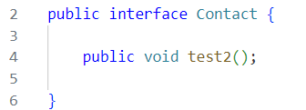
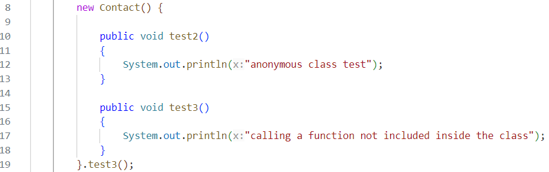

# Anonymous class & Lambda Notes !

1. A functional Interface (it is an interface that conatians only one function)
    1. Can be a refernce to anonymous class.
    2. Can be a refernce to Lambda.
       1. **ex**: Contact c = () -> System.out.println("lambda");

2. Abstract class (that conatians only one function)
    1. Can be a refernce to anonymous class.
    2. Can't be arefernce to Lambda.

3. Interface / Abstract class (that conatians **more than one function**)
    1. Can't be a refernce to anonymous class **Except if you overrided all the functions**.
    2. Can't be a refernce to Lambda.
       
4. If you added a function (not included) inside Anonymous class.
     1. You can **Refernce** to it by all types (**interface, abtract class,normal class --no need to override--**), if you already overrided the functions, **But you can't call this funtion by the object**.
     2. If no Reference, Then you can write anonymous class directly and then **it be called ONCE if you Call the function directly after the anonymous class and before the semicolon ;** 

5. To be Continued
