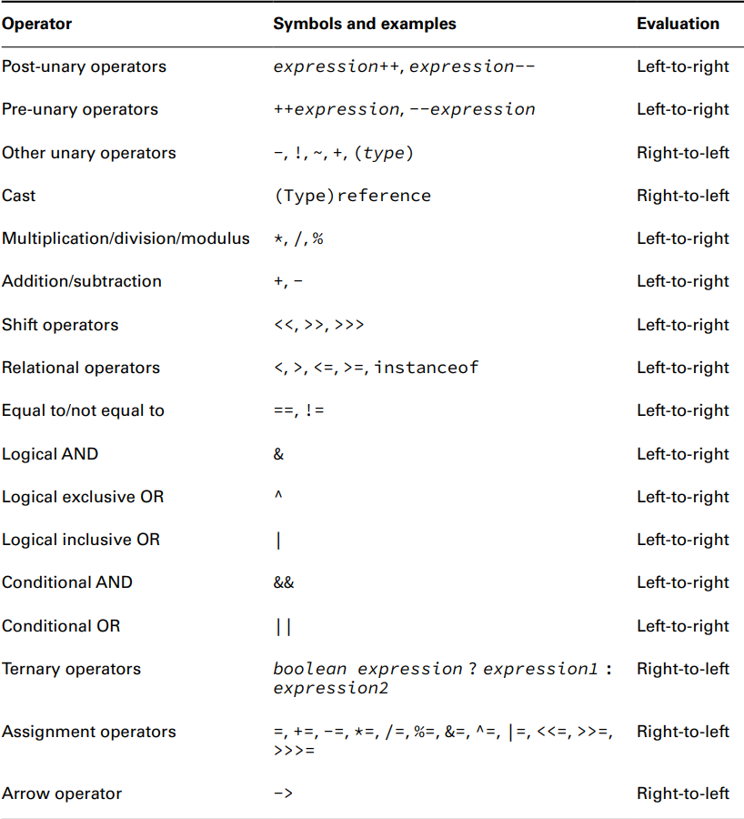
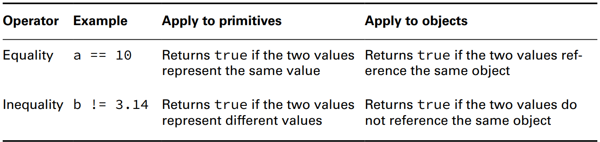

# Operators

* `~` *bitwise complement operator* only be applied to integer numeric types such as `byte`, `short`, `char`, `int`, 
  and `long` it uses `-1*number - 1`
```java
    int value = 3; // Stored as 0011
    int complement = ~value; // Stored as 1100
    System.out.println(value); // 3
    System.out.println(complement); // -4
```
* the `x % y` results in a value between `0` and `(y - 1)`



* Numeric Promotion Rules 
  * If two values have different data types, values will be promoted to the larger type
  * Smaller data types like `byte`, `short`, and `char`, are first promoted to int any time they’re used with a Java binary arithmetic operator with a **variable not a value**.
* casting an object only changes the reference to the object, not the object itself
* assign larger type to smaller without casting results in **compile time** error
* casting is required when 
  * going from a larger numerical data type to a smaller numerical data type
  * converting from a floating-point number to an integral value
* The left side of the compound operator can be applied only to a variable that is already defined and cannot be used to declare a new variable
* the compiler will **automatically cast** the resulting value to the data type of the value on the left side of the compound operator
* `x = x++; // RETURNS X NOT X++`



* The equality operator can be applied to numeric values, boolean values, and objects (including String and null). When applying the equality operator, you cannot mix these types.

```java
    boolean monkey = true == 3; // DOES NOT COMPILE
    boolean ape = false != "Grape"; // DOES NOT COMPILE
    boolean gorilla = 10.2 == "Koko"; // DOES NOT COMPILE
```
* `||` looks for the first `true` and `&&` looks for the first `false`
* For object comparison, the `==` is applied to the `references` to the `objects`,
  not the `objects` they point to. Two references are equal if and only if they point to the same
  `object` or both point to `null`
## instanceof Operator
* `e instanceof String` Returns true if the reference on the left side is an instance of the type on the right side 
  **-can't be a `null`-** (`class`, `interface`,`record`, `enum`, `annotation`) at runtime.
* **It is considered a good coding practice to use the instanceof operator prior to casting from one object to a narrower type**.
* using `instanceof` with incompatible types causes a compilation error. If the compiler can determine that a variable cannot possibly be cast to a specific class, it reports an error.
* instanceof on the `null` literal or a `null` reference always returns `false`.
